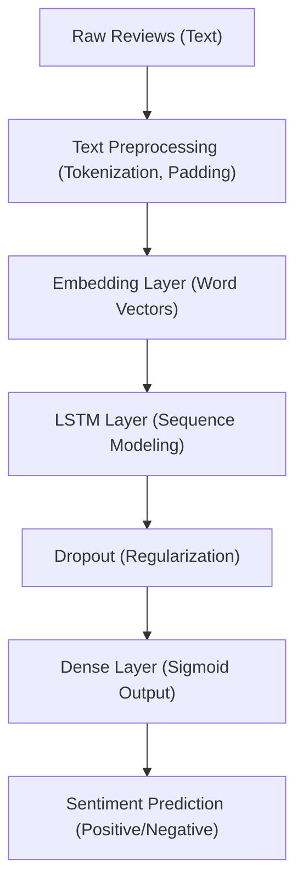

# Restaurant Review Sentiment Classification

This project classifies restaurant reviews as positive or negative using a deep learning model (LSTM) in Keras/TensorFlow.

## Dataset
- **File:** `Restaurant_Reviews.tsv`
- **Format:** Tab-separated, with columns `Review` (text) and `Liked` (1=positive, 0=negative)
- **Task:** Supervised binary sentiment classification

## Technical Overview
This project demonstrates a modern NLP pipeline for text classification using deep learning. The workflow includes:
- Data loading and preprocessing
- Text tokenization and sequence padding
- Neural network model with Embedding and LSTM layers
- Model training, evaluation, and prediction

### Data Pipeline and Model Architecture



#### Explanation of Each Component
- **Raw Reviews (Text):** Input data consists of unstructured text reviews.
- **Text Preprocessing:** Reviews are tokenized (converted to integer word indices) and padded to a fixed length for batch processing.
- **Embedding Layer:** Learns dense vector representations (embeddings) for each word, capturing semantic similarity. This allows the model to understand relationships between words beyond simple one-hot encoding.
- **LSTM Layer:** Long Short-Term Memory (LSTM) is a type of recurrent neural network (RNN) designed to capture long-range dependencies and context in sequential data. LSTMs are well-suited for NLP tasks because they can remember information over long sequences, making them effective for understanding the sentiment of a review based on word order and context.
- **Dropout:** Regularization technique to prevent overfitting by randomly dropping units during training.
- **Dense Layer (Sigmoid Output):** Outputs a probability (0 to 1) representing the likelihood of positive sentiment. A threshold of 0.5 is used for binary classification.
- **Sentiment Prediction:** The final output is either "Positive" or "Negative" sentiment.

### Model Details
- **Embedding Layer:**
  - Input dimension: 5000 (vocabulary size)
  - Output dimension: 64 (embedding vector size)
  - Purpose: Maps each word index to a dense vector, allowing the model to learn word relationships during training.
- **LSTM Layer:**
  - Units: 64 (number of memory cells)
  - Purpose: Processes the sequence of word embeddings, capturing context and dependencies in the review text.
- **Dropout Layer:**
  - Rate: 0.5 (50% of units dropped during training)
  - Purpose: Reduces overfitting by preventing the model from relying too heavily on any one feature.
- **Dense Output Layer:**
  - Units: 1 (single output neuron)
  - Activation: Sigmoid (outputs probability of positive sentiment)

### Why LSTM and Embedding for NLP?
- **Embedding:** Traditional one-hot encoding is sparse and does not capture semantic similarity. Embeddings provide dense, trainable representations that encode relationships between words, improving model performance on NLP tasks.
- **LSTM:** Standard feedforward networks cannot capture sequence information. LSTMs are designed to handle sequential data, making them ideal for text, where word order and context are crucial for understanding sentiment.

## Setup
1. Clone this repository or download the files.
2. Install dependencies:
   ```bash
   pip install -r requirements.txt
   ```
3. Make sure `Restaurant_Reviews.tsv` is in the project directory.

## Usage
1. Run the script:
   ```bash
   python restaurant_review_classification.py
   ```
2. The script will train the model, evaluate it, and print example predictions.

## Example
After training, use the `predict_review` function in the script:
```python
print(predict_review('The food was amazing and the service was excellent!'))  # Positive
print(predict_review('I did not like the food at all.'))  # Negative
```

## License
This project is for educational purposes. 